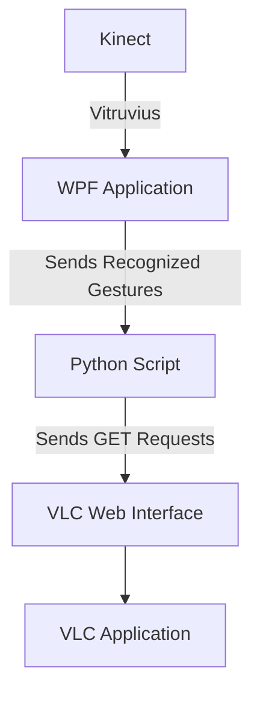

# Kinect VLC Interface

Application to pause and play a video playing on VLC through the VLC web interface using gestures on kinect for XBOX One
This is part of the first lab of Human Computer Interface Course.

## Software Architecture 
We use the Vitruvius utilities to read the gestures from the Kinect to our WPF Application. We used the sample Gesture Control Application from their repository as a base for our application.
[LightBuzz-Vitruvius Repository](https://github.com/LightBuzz/Vitruvius)

We used the SwipeLeft Gesture for pause ans SwipeRight Gesture for play.

This WPF application then ran a python script whenever a recognized gesture was invoked

We used a python script to control the VLC player through the VLC web interface. The python script sent the appropriate GET requests to the VLC web interface to generate the appropriate output.
[VLC Web Interface Documentation](https://wiki.videolan.org/Documentation:Modules/http_intf/)

## How to Use

### VLC Web Interface
Enable control through VLC web interface by following the instruction in the [documentation]([https://wiki.videolan.org/Documentation:Modules/http_intf/#VLC_2.0.0_and_later](https://wiki.videolan.org/Documentation:Modules/http_intf/#VLC_2.0.0_and_later))

### WPF Application
Open the project in Visual Studio code. Run and compile the file.
You will have to change the password to the one you have set for your web interface

## Futher Work
- [ ]  Add an input box on the application to that the user may enter his password associated with the web interface
- [ ] Add more gestures and maybe also custom gestures to control other aspects of the web player.  